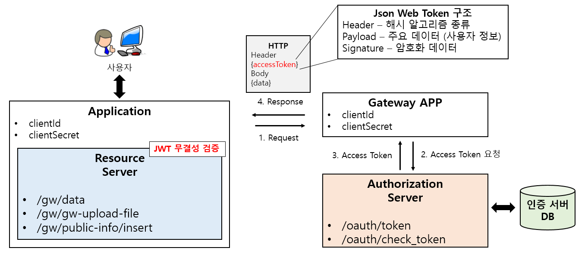
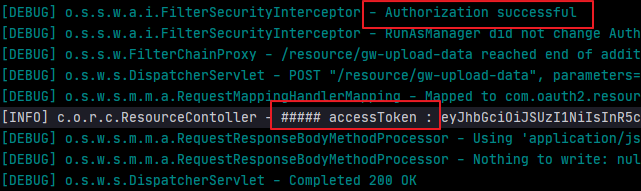

# security-oauth2-authentication

SpringSecurity 를 이용하여 OAuth2 인증 서버 자체 구현한 프로젝트

    

## OAuth2.0 인증 프로젝트 확인 사전 조건
### 1. authentication-server, resource-server, client-server 모두 정상 기동되어야 한다.

### 2. DB 스키마 작성 및 기준 데이터 생성
1. DB 테이블 생성 ( OAuth2.0 관련 DB 테이블 )

아래 사이트의 *2-2. 인증 정보 DB 테이블* 를 참고해라.
> https://velog.io/@skysoo/%EB%B0%B1%EC%97%94%EB%93%9C-%EA%B0%9C%EB%B0%9C%EC%9E%90-%EB%A1%9C%EB%93%9C%EB%A7%B5-%EB%94%B0%EB%9D%BC%EA%B0%80%EA%B8%B0-10.-OAuth2.0

2. DB 데이터 생성

위 사이트의 *2.7 인증 Client 정보 생성* 을 참고해라.
    
### 3. 비대칭키 생성 (JWT 토큰의 무결성 검증에 사용할 Private Key, Public Key)
1. authentication-server
> oauth2jwt.jks 파일 생성

2. resource-server
> publicKey.txt 파일 생성

### 4. 프로젝트 정상 구동 확인

기동 로그에서 아래와 같이 확인 가능하다.
 



## OAuth2.0 승인 종류
이 프로젝트에서 구현한 승인 방식은 아래 4가지 중 4번 클라이언트 자격 증명 방식이다.

클라이언트 자격 증명 방식이란, 쉽게 말해 서버간(리소스서버-클라이언트서버) 통신을 의미한다. 

1. 권한 코드 승인 (Authorization Code Grant Type)
2. 암시적 승인 (Implicit Grant)
3. 리소스 소유자 비밀번호 자격 증명 (Resource Owner Password Credentials Grant)
4. 클라이언트 자격 증명 (Client Credentials Grant Type)

## 토큰 종류
### 1. Bearer Token
### 2. Json Web Token(JWT) 

> JWT 방식은 아래와 같은 특징 있다.
```
 * JWT 방식은 Json String이 암호화된 방식으로 토큰 + 특정 정보 (사용자 정보)를 같이 셋팅
 * 이렇게 되면 DB를 사용하지 않는다. 이유는 토큰 자체로 인증 정보를 관리하기 때문이다.
 * 인증 서버로의 토큰 추가 검증 요청이 없기 때문에 인증 서버 요청 오버헤드를 줄일 수 있다.
 * JWT 는 Stateless 로 쿠키나 세션을 가지고 있지 않기 때문에 관리 포인트도 줄어든다.
```        